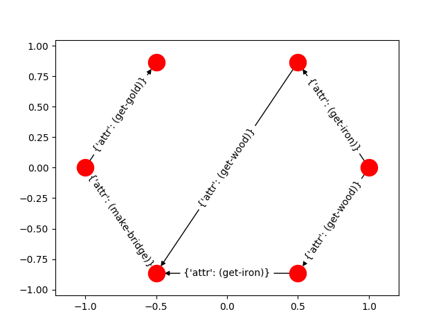

# PDDL-RM
Generating Reward Machines from high-level PDDL models using Partial-Ordered Plan (Adapted from [POP-GEN](https://bitbucket.org/haz/pop-gen/), [QRM](https://bitbucket.org/RToroIcarte/qrm))

### Installation
```
git clone https://github.com/yanxi0830/pop-rm.git
cd pop-rm

conda create --name py27 python=2.7   # Python 2 for now, TODO: change to Python 3
conda activate py27
python -m pip install -U matplotlib
pip install networkx==2.2

# Gurobi
# Need to get license..
conda config --add channels http://conda.anaconda.org/gurobi
conda install gurobi
grbgetkey LICENSE-CODE
```

### Run
```
cd src
python run.py --domain ../domains/craft/domain.pddl --problem ../domains/craft/t9.pddl --plan ../domains/craft/t9.plan
```

### Example
Given the task of getting gold, and the rules of Minecraft described in PDDL. 
This package encodes the actions sequences into a finite state machine. 

